<!-- Documentação técnica do projeto -->
 # Definição do Tema

O Sistema de Manutenção Preventiva e Corretiva é um software destinado ao gerenciamento do ciclo de vida de máquinas e equipamentos industriais, com foco em minimizar o tempo de inatividade e otimizar a performance operacional. Ele permite o controle das manutenções preventivas (realizadas regularmente para evitar falhas) e corretivas (realizadas após uma falha). O sistema também inclui funcionalidades para registrar falhas, gerenciar técnicos, gerar relatórios e acompanhar indicadores de desempenho, como o MTTR (Mean Time to Repair - Tempo Médio de Reparo) e o MTBF (Mean Time Between Failures - Tempo Médio Entre Falhas).

# Análise de Requisitos e Escopo

## Funcionalidades Principais

### Gerenciamento de Máquinas e Equipamentos
- Cadastro de máquinas, incluindo especificações técnicas, data de aquisição e localização.
- Visualização e edição de informações de máquinas.

### Registro e Controle de Manutenções
- Registro de manutenções preventivas e corretivas.
- Histórico completo de manutenções para cada máquina.
- Registro de peças substituídas e tempo de inatividade.

### Gerenciamento de Falhas
- Registro de falhas ocorridas, classificando a severidade e identificando o operador.
- Controle de falhas por máquina.

### Gerenciamento de Técnicos
- Cadastro de técnicos, incluindo suas especialidades e disponibilidade.

### Relatórios e Indicadores
- Geração de relatórios de manutenção, tempo de inatividade, falhas e peças trocadas.
- Cálculo de indicadores como MTTR e MTBF.

### Integração com API
- Utilização de uma API REST (JSON-Server) para armazenar e recuperar dados.

# Requisitos Funcionais

- O sistema deve permitir o cadastro de máquinas com suas especificações.
- O sistema deve registrar manutenções preventivas e corretivas, associando técnicos e peças trocadas.
- O sistema deve gerar relatórios de manutenção e indicadores de performance.
- O sistema deve oferecer uma interface gráfica intuitiva para o usuário final.

# Requisitos Não Funcionais

- O sistema deve ser responsivo, com tempo de resposta rápido ao realizar operações com a API.
- A interface deve ser amigável e permitir fácil navegação entre as funcionalidades.
- O sistema deve armazenar e recuperar dados de maneira segura e eficiente.

# Escopo do Projeto: Sistema de Manutenção Preventiva e Corretiva

## Definição do Tema

O Sistema de Manutenção Preventiva e Corretiva é um software destinado ao gerenciamento do ciclo de vida de máquinas e equipamentos industriais, com foco em minimizar o tempo de inatividade e otimizar a performance operacional. Ele permite o controle das manutenções preventivas (realizadas regularmente para evitar falhas) e corretivas (realizadas após uma falha). O sistema também inclui funcionalidades para registrar falhas, gerenciar técnicos, gerar relatórios e acompanhar indicadores de desempenho, como o MTTR (Mean Time to Repair - Tempo Médio de Reparo) e o MTBF (Mean Time Between Failures - Tempo Médio Entre Falhas).

## Objetivos

- Desenvolvimento da interface gráfica (Swing) para o gerenciamento de máquinas, técnicos e manutenções.
- Implementação de funcionalidades CRUD para máquinas, manutenções, falhas e técnicos.
- Geração de relatórios com base nos dados registrados, incluindo indicadores de desempenho.
- Conexão com API para armazenar e manipular dados em tempo real.
- Validação e testes para garantir a robustez do sistema.

## Análise de Requisitos e Escopo

### Funcionalidades Principais

- **Gerenciamento de Máquinas e Equipamentos**:
  - Cadastro de máquinas, incluindo especificações técnicas, data de aquisição e localização.
  - Visualização e edição de informações de máquinas.
  
- **Registro e Controle de Manutenções**:
  - Registro de manutenções preventivas e corretivas.
  - Histórico completo de manutenções para cada máquina.
  - Registro de peças substituídas e tempo de inatividade.
  
- **Gerenciamento de Falhas**:
  - Registro de falhas ocorridas, classificando a severidade e identificando o operador.
  - Controle de falhas por máquina.
  
- **Gerenciamento de Técnicos**:
  - Cadastro de técnicos, incluindo suas especialidades e disponibilidade.
  
- **Relatórios e Indicadores**:
  - Geração de relatórios de manutenção, tempo de inatividade, falhas e peças trocadas.
  - Cálculo de indicadores como MTTR e MTBF.
  
- **Integração com API**:
  - Utilização de uma API REST (JSON-Server) para armazenar e recuperar dados.

## Requisitos Funcionais

- O sistema deve permitir o cadastro de máquinas com suas especificações.
- O sistema deve registrar manutenções preventivas e corretivas.
- O sistema deve gerar relatórios de manutenção e indicadores de performance.
- O sistema deve oferecer uma interface gráfica intuitiva para o usuário final.
- O sistema deve implementar funcionalidades CRUD para máquinas, manutenções, falhas e técnicos.

## Requisitos Não Funcionais

- O sistema deve ser responsivo, com tempo de resposta rápido ao realizar operações com a API.
- A interface deve ser amigável e permitir fácil navegação entre as funcionalidades.
- O sistema deve armazenar e recuperar dados de maneira segura e eficiente.

## Levantamento de Recursos

### Recursos Técnicos

- **Ambiente de Desenvolvimento**: Visual Studio Code para desenvolvimento da aplicação Java.
- **Banco de Dados**: Utilização de arquivos JSON para armazenamento de dados (via JSON-Server).
- **API**: JSON-Server para desenvolvimento da API REST.

## Análise de Riscos

### Riscos Técnicos

1. **Complexidade na Integração com API**: A comunicação entre o frontend e a API pode apresentar problemas.
   - **Mitigação**: Realizar testes de integração enquanto desenvolve.

2. **Desempenho do Sistema**: O sistema pode ter performance abaixo do esperado.
   - **Mitigação**: Testar e otimizar consultas ao banco de dados.

### Riscos de Projeto

1. **Prazo de Entrega**: O projeto pode exceder o prazo de conclusão.
   - **Mitigação**: Estabelecer um cronograma realista, dividindo o trabalho em etapas.

2. **Mudanças nos Requisitos**: Alterações inesperadas podem impactar o projeto.
   - **Mitigação**: Manter flexibilidade para ajustes conforme necessário.

### Riscos de Usuário

1. **Aceitação do Usuário Final**: A interface pode não ser adotada se não for intuitiva.
   - **Mitigação**: Buscar feedback de usuários potenciais ao longo do desenvolvimento.

## Conclusão

Este escopo estabelece as bases para o desenvolvimento do Sistema de Manutenção Preventiva e Corretiva, garantindo que os objetivos sejam alcançados, os recursos adequados estejam disponíveis e os riscos sejam gerenciados de forma eficaz.

## Diagrama de classe
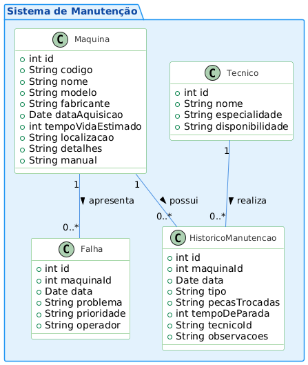

## Diagrama de sequencia
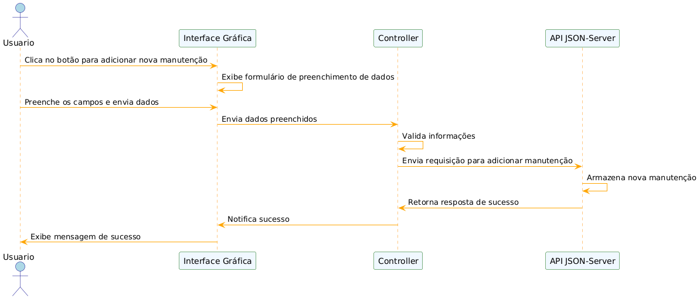

## Testes de API -
## MÁQUINAS - GET
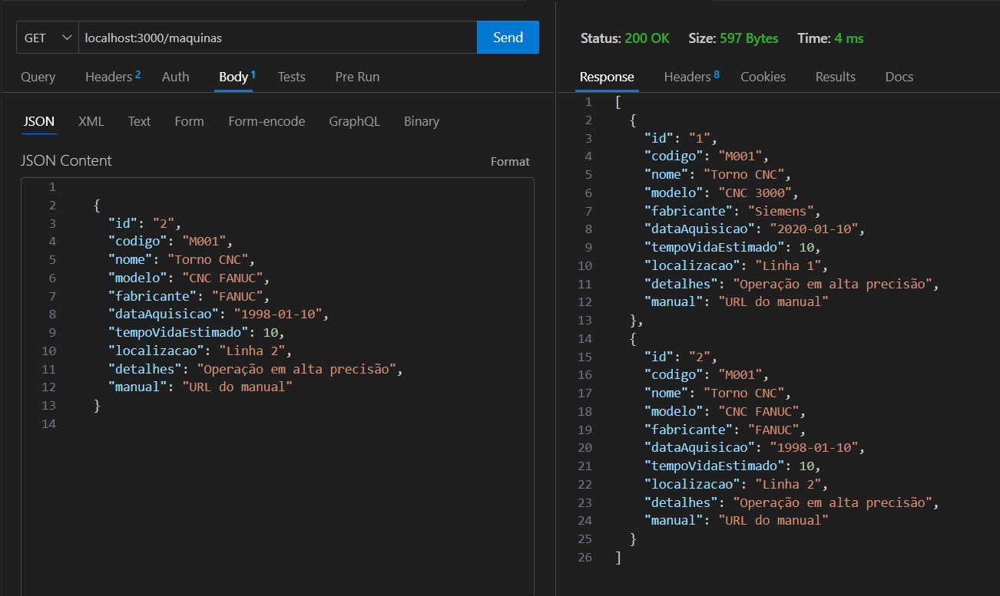

## MÁQUINAS - POST
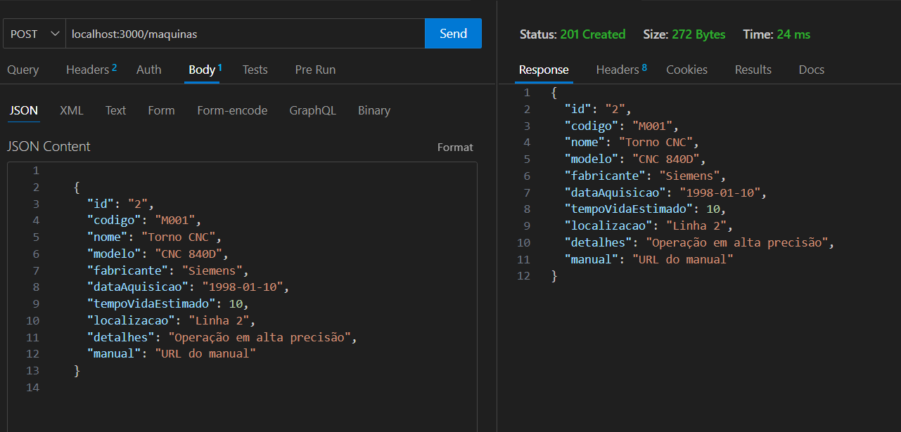

## MÁQUINAS - PUT
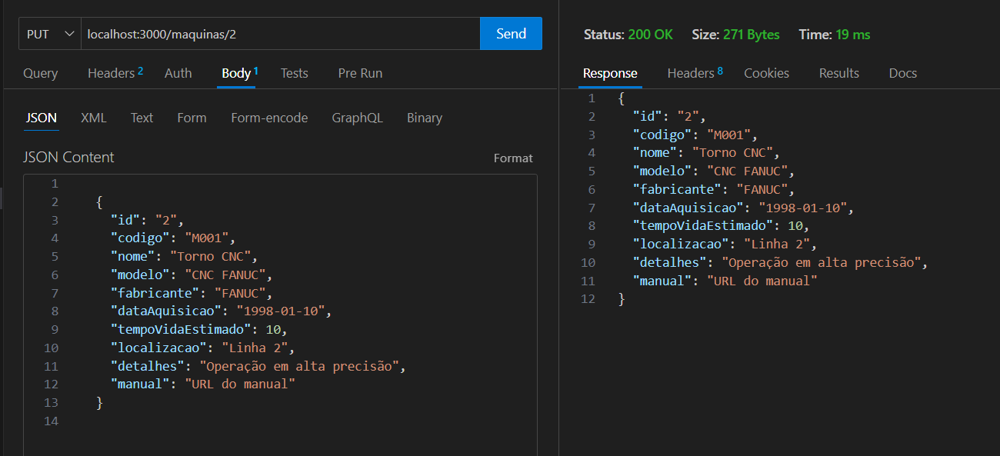

## MÁQUINAS - DELETE
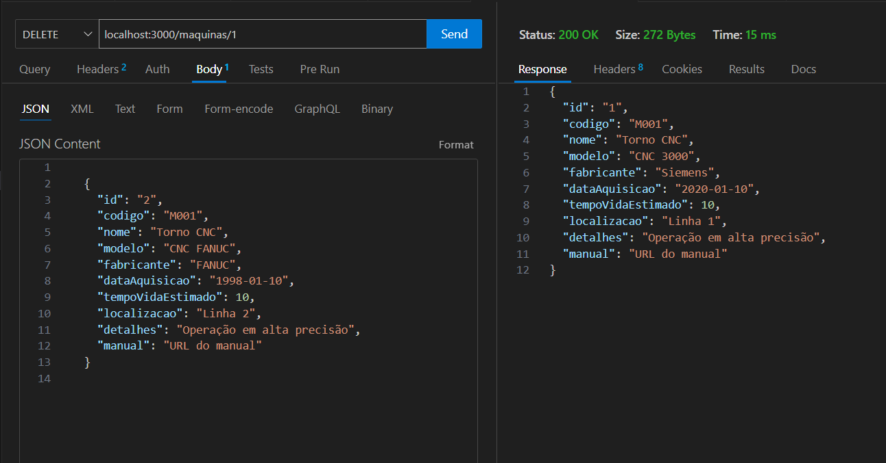

## MÁQUINAS - GET PÓS DELETE
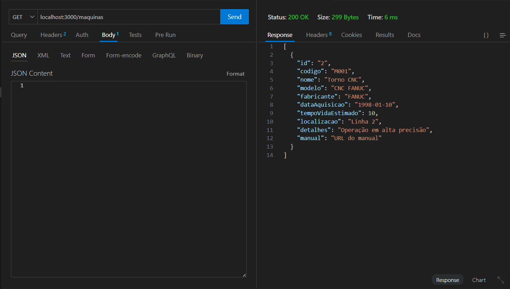

## HISTÓRICO DE MANUTENÇÃO - GET
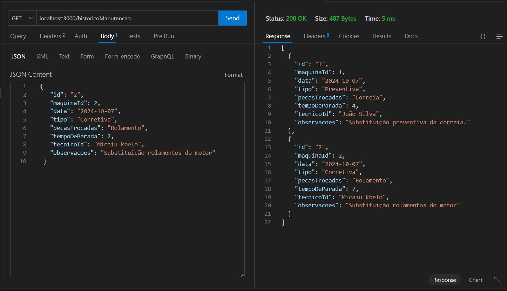

## HISTÓRICO DE MANUTENÇÃO - POST
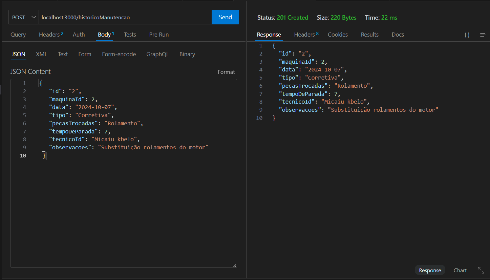

## FALHAS - GET
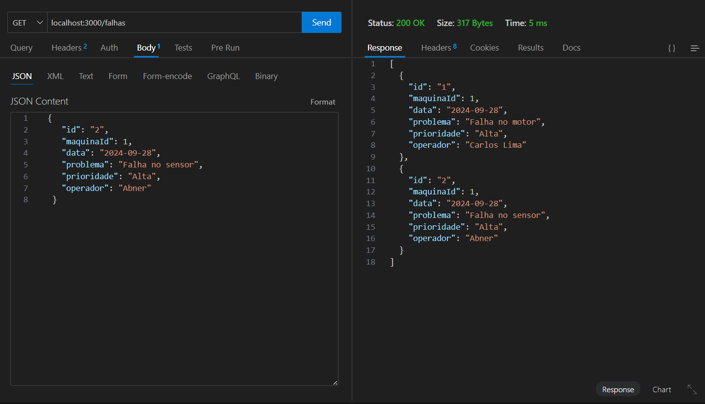

## FALHAS - POST
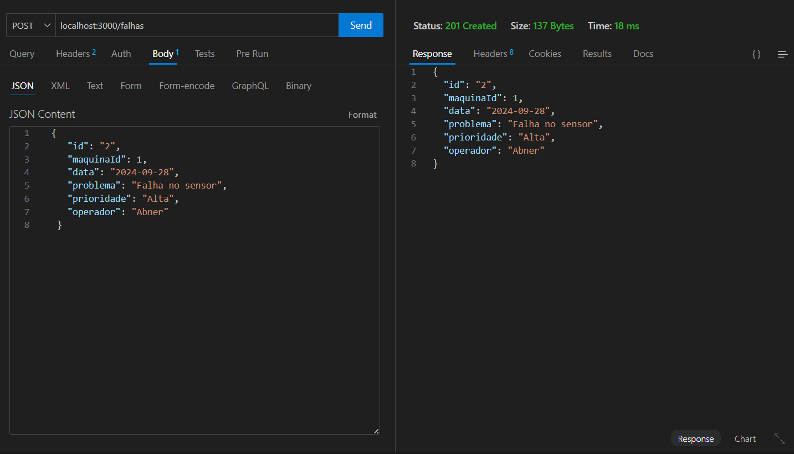

## TÉCNICO - GET
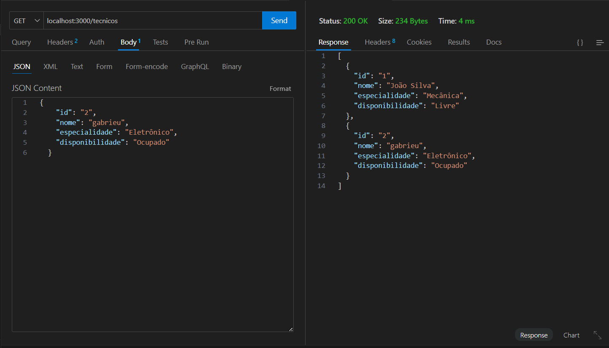

## TÉCNICO - POST
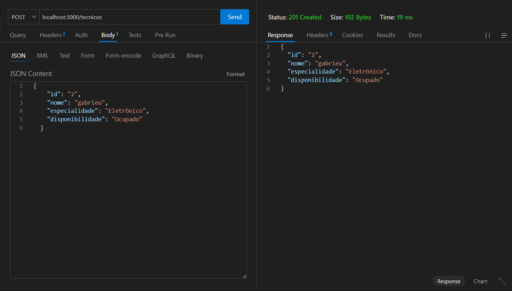

## TÉCNICO - DELETE
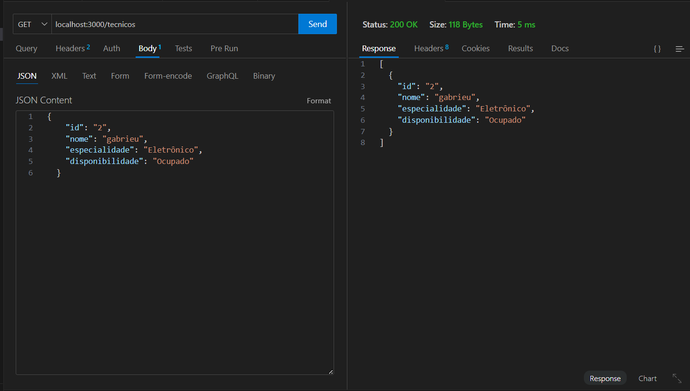

## TÉCNICO - GET PÓS DELETE
